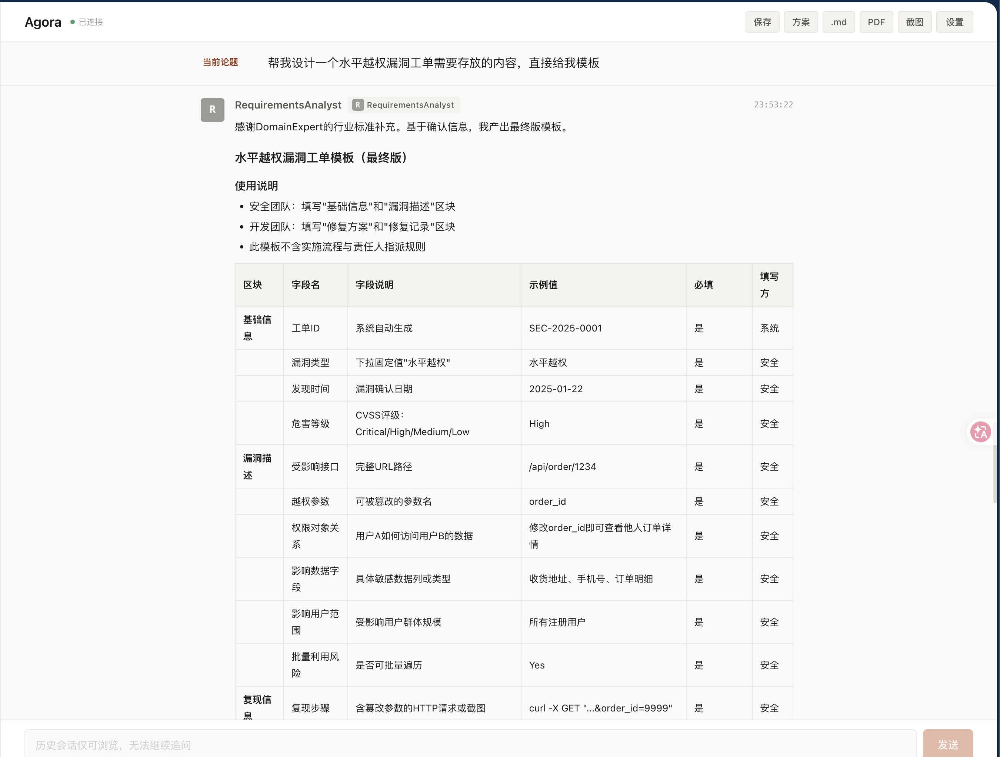
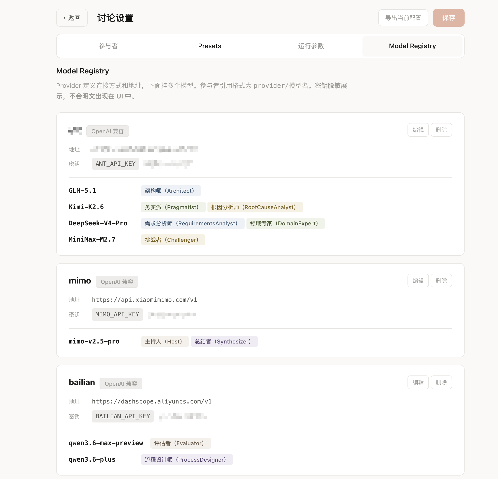
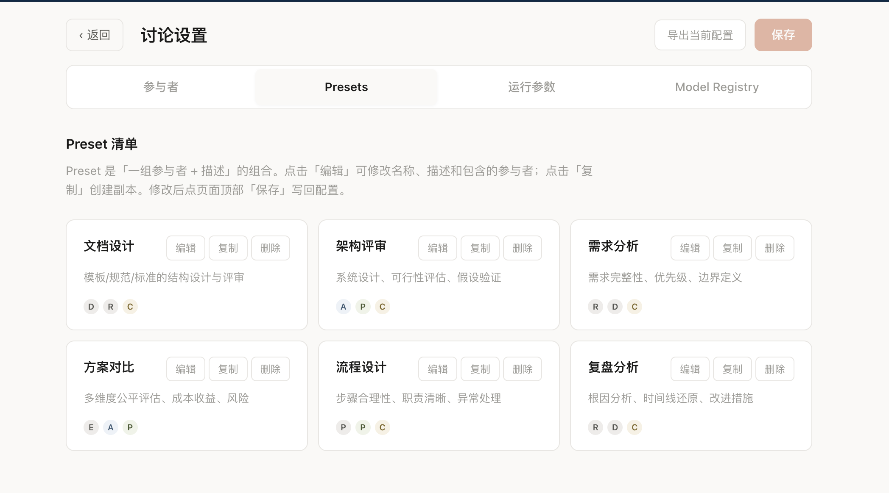

# Agora

> 基于 Microsoft Semantic Kernel 的多 Agent 群组讨论、投票与报告生成工具，提供 **CLI** 与 **Web UI** 两种交互方式。

让多个不同模型、不同人设的 LLM agent 围绕一个议题进行有主持人控场的真实讨论，独立投票，并自动产出可读的会议纪要。

## Features

- **多角色协作**：主持人 (Host) + 架构师 / 务实派 / 反方等专家 agent，每个 agent 可挂不同模型
- **Agent 预设 (Preset)**：根据议题类型自动匹配讨论参与者组合——架构评审、需求分析、方案对比、流程设计、复盘分析、文档设计，共 6 种预设
- **LLM 驱动主持**：基于 Semantic Kernel `GroupChatOrchestration`，由主持人 LLM 决定谁发言、何时收敛
- **议题精炼（可选）**：讨论开始前由主持人通过多轮 Q&A 帮用户把模糊议题精炼为可讨论的精准问题
- **Blueprint 生成**：讨论结束后自动生成 Agent 系统蓝图（角色、工作流、评估标准），支持导出为 JSON / YAML / Markdown / Prompt Pack
- **独立投票**：专家 agent 并行表态（赞成 / 反对 / 中立 + 置信度 + 理由），本地聚合
- **追问 (Follow-up)**：投票后用户可基于完整对话上下文追加问题
- **报告归档**：经用户确认后保存为结构化 markdown 报告，沉淀讨论资产
- **Web UI**：实时 timeline 展示发言、流式打字、投票卡、报告管理

## Screenshots

<p align="center">
  
  
</p>
<p align="center">
  
</p>

## Installation

### Prerequisites

- Python ≥ 3.10
- Node.js ≥ 18（仅 Web UI 需要）
- 一个 OpenAI 兼容的 LLM 端点（OpenAI 官方 / Azure OpenAI / 本地代理 / 第三方兼容服务）

### 安装步骤

```bash
# 克隆仓库后进入项目目录
cd agora

# 安装后端依赖和开发测试依赖
pip install -e ".[dev]"

# 安装前端依赖
cd frontend && npm install
```

> 安装完成后，`agora`（CLI）和 `agora-web`（Web 后端）两个命令会全局可用。

默认配置使用环境变量读取 key。可复制 `.env.example` 为 `.env`，填入兼容模型服务的 key；本地 SSE 代理 key 可留空。

## Quick Start

### 方式 A：Web UI（推荐）

```bash
./start.sh
```

启动后访问：
- 前端：http://localhost:5173
- 后端：http://localhost:8001

首次运行会自动 `npm install` 前端依赖。`Ctrl+C` 同时停止两个进程。

### 方式 B：CLI

```bash
# 使用内置默认配置
agora -t "我们应该用 GraphQL 还是 REST？"

# 指定自定义配置
agora -c /path/to/my_agents.yaml -t "评估架构 Y"

# 详细日志
agora -t "测试" -v
```

## Usage

### 一次完整的会话流程

```
用户输入议题
    ↓
[brainstorming] 主持人多轮 Q&A 精炼议题（可跳过）
    ↓
[discussion]    专家 agents 由主持人调度轮流发言
    ↓
[summary]       主持人汇总讨论结论
    ↓
[voting]        每个 agent 独立投票 + 理由
    ↓
[follow-up]     用户追问（可选，支持多轮）
    ↓
[saved]         用户确认后保存为 markdown 报告
```

### 配置文件示例（`src/config/agents.yaml`）

本地需要写真实 key 时，复制 `src/config/agent.yaml.example` 为 `src/config/agent.yaml`。`agent.yaml` 已被 Git 忽略；Web 和 CLI 会优先读取它，未创建时使用仓库内的 `src/config/agents.yaml`。

```yaml
manager_service_index: 0  # 用第几个 agent 的 service 作为主持人 LLM
default_preset: architecture_review

presets:
  architecture_review:
    label: "架构评审"
    agents: [Architect, Pragmatist, Challenger]

agents:
  - name: Host
    description: "主持人，控场 + 选人 + 收敛"
    instructions: "你是讨论主持人……"
    service_type: openai_compatible
    model: gpt-4o
    api_key: "${YOUR_API_KEY}"
    base_url: "https://your-endpoint.com/v1"

  - name: Architect
    description: "架构师，关注系统设计与模块边界"
    instructions: "你是一位资深架构师……"
    service_type: openai_compatible
    model: glm-4.6
    api_key: "${YOUR_API_KEY}"
    base_url: "https://your-endpoint.com/v1"

  - name: Synthesizer
    description: "总结者，最后输出行动项"
    final_only: true   # 仅在终结轮发言
    instructions: "请输出可执行的下一步……"
    service_type: openai_compatible
    model: gpt-4o
    api_key: "${YOUR_API_KEY}"
    base_url: "https://your-endpoint.com/v1"

# 可选：覆盖默认配置
discussion:
  enabled: true
  max_rounds: 10

voting:
  enabled: true

brainstorm:
  enabled: true
  max_rounds: 10
  answer_timeout_seconds: 300
```

环境变量插值用 `${VAR_NAME}` 语法，自动从 `os.environ` 读取；可用 `${VAR_NAME:-}` 表示缺失时使用空值。

## Configuration

### Pipeline 开关

```yaml
discussion:
  enabled: true       # 关闭则跳过群组讨论
  max_rounds: 10      # 硬上限

voting:
  enabled: true       # 关闭则跳过投票

brainstorm:
  enabled: true       # 关闭则直接进入 discussion
  max_rounds: 10      # 主持人最多追问轮数
```

### Agent 预设 (Presets)

配置文件顶层的 `presets` 字段定义可选的讨论参与者组合。主持人在 brainstorm 阶段自动推荐最匹配的 preset：

| Preset | 参与者 | 适用场景 |
|--------|--------|---------|
| `architecture_review` | Architect + Pragmatist + Challenger | 系统设计、可行性评估 |
| `requirements_analysis` | RequirementsAnalyst + DomainExpert + Challenger | 需求完整性、优先级 |
| `solution_comparison` | Evaluator + Architect + Pragmatist | 多方案对比评估 |
| `process_design` | ProcessDesigner + Pragmatist + Challenger | 流程设计、职责划分 |
| `incident_review` | RootCauseAnalyst + DomainExpert + Challenger | 复盘分析、根因定位 |
| `document_design` | DomainExpert + RequirementsAnalyst + Challenger | 文档/模板/规范设计 |

### 内置示例配置

| 文件 | 用途 |
|------|------|
| `src/config/agent.yaml.example` | 本地私有配置模板，复制为被忽略的 `agent.yaml` 后填写真实 key |
| `src/config/agents.yaml` | 默认完整配置（含 8 个 agent + 6 种 preset） |
| `src/config/agents_optimized.yaml` | agents.yaml 的优化变体（A/B test，仅覆盖差异项） |
| `src/config/discussion_only.yaml` | 仅讨论，不投票 |
| `src/config/voting_only.yaml` | 仅投票，不讨论 |

## License

本项目从 Semantic Kernel 主仓库拆出后独立管理，许可证沿用上游 MIT License。
